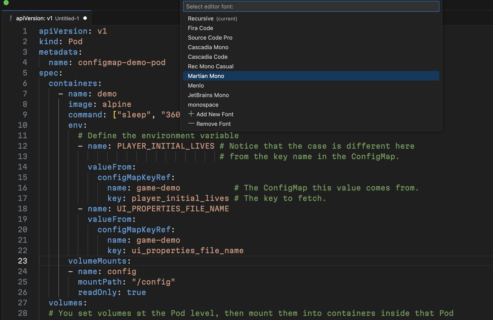

# Font Switch

Switch your VS Code editor font family with live preview and easy management.

## Features

- **Live Preview**: See font changes instantly as you navigate the list
- **Font Management**: Add new fonts or remove existing ones
- **Dynamic List**: Automatically loads fonts from your current `editor.fontFamily` setting
- **Fast & Responsive**: Optimized for smooth navigation and instant loading

## Screenshot

## How To Use

### Via Command Palette

1. Open Command Palette (`Ctrl+Shift+P` / `Cmd+Shift+P`)
2. Type "Font Switch" and select **"Font Switch: Set editor font"**

### Font Selection Interface

- **Navigate**: Use arrow keys to preview fonts instantly in your editor
- **Select**: Press `Enter` to apply the selected font
- **Cancel**: Press `Escape` to revert to original font

### Font Management

- **Add Font**: Select `$(add) Add New Font` to input a new font name
- **Remove Font**: Select `$(remove) Remove Font` to choose which font to remove
- **Current Font**: Marked with "(current)" in the list

## Usage Notes

- The extension works with your existing `editor.fontFamily` setting
- New fonts are added to the front of your font stack
- Live preview updates your editor font temporarily during selection
- Changes are persisted only when you press Enter

## Requirements

- VS Code 1.74.0 or later

## License

[MIT License](https://github.com/ufateh/vscode-font-switch/blob/master/LICENSE)
